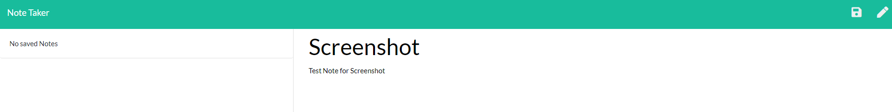

# Good ReadME Generator

## Table of Contents

1. [Description](#description)
2. [Installation](#installation)
3. [Usage](#usage)
4. [License](#license)
5. [Screenshot](#screenshot)
6. [Walkthrough Video](#walkthrough)

## Description:
Completed as a homework assignment for Washington University's Fullstack Web Development Program. The purpurpose of the application is using inquirer.js to ask the user for a series of prompts, the responses to which will be compiled into a md file with formatting appropriate for a ReadMe.

## Installation: 
First run npm install to install the required npm dependencies. From there, the application can be run from the command line using "node app.js".

## Usage:
Upon running the application, it will prompt the user with the headers requested by the assignment. The user can enter the appropriate text and the application will appropriately format a ReadME.

## License: 
MIT

## Contributing: 
[Myrmoxenus](https://github.com/Myrmoxenus)

## Screenshot: 

## Walkthrough:
[Link to Walkthrough Video!](https://drive.google.com/drive/folders/14_x_SZZa_f6u6mtyQxYZtJMleikLuig4?usp=sharing)